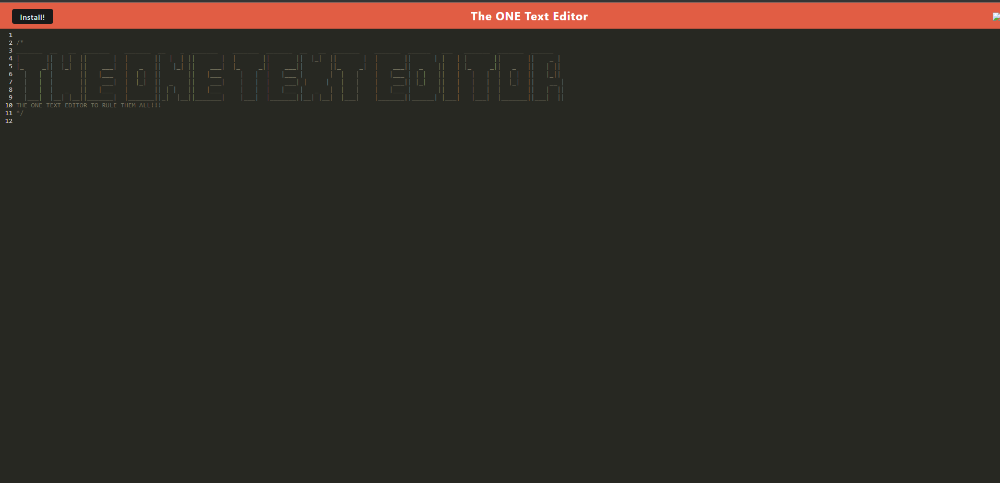

  

  <h3 align="center">LINK TO DEPLOYED APPLICATION: https://the-one-text-editor-d57e0a8d0ba0.herokuapp.com/<h3>

# Table of Contents

- [Description](#description) 

- [Usage](#usage)

- [Technologies Used](#technologies-used)

- [Acceptance Criteria](#acceptance-criteria)

- [Examples of application](#examples-of-application)

## Description

This text editor....the ONE TEXT EDITOR.....TO RULE THEM ALL!!
This text editor is actually not as different as the title says! This is a simple text editor that allows for the creation and manipulation of text. 
Also, you are able to use it's full functionality offline as well! One last intricate feature is that you can also download the webpage afterwards to use 
later on as well!

## Usage

Public Repo link: https://github.com/Idjjurado/The-one-text-editor

## Technologies used

I ended up using quite a few different things!

- IndexedDB, Webpack, Babel, Herooku, Prettier, Node, Express, and JavaScript as well!

## Credit

Ismael Jimenez: https://github.com/Idjjurado

## License

MIT License (see repo)

## Acceptance Criteria:

### User Story!

AS A developer
I WANT to create notes or code snippets with or without an internet connection
SO THAT I can reliably retrieve them for later use

## GIVEN a text editor web application

- WHEN I open my application in my editor
  - THEN I should see a client server folder structure
- WHEN I run `npm run start` from the root directory
  - THEN I find that my application should start up the backend and serve the client
- WHEN I run the text editor application from my terminal
  - THEN I find that my JavaScript files have been bundled using webpack
- WHEN I run my webpack plugins
  - THEN I find that I have a generated HTML file, service worker, and a manifest file
- WHEN I use next-gen JavaScript in my application
  - THEN I find that the text editor still functions in the browser without errors
- WHEN I open the text editor
  - THEN I find that IndexedDB has immediately created a database storage
- WHEN I enter content and subsequently click off of the DOM window
  - THEN I find that the content in the text editor has been saved with IndexedDB
- WHEN I reopen the text editor after closing it
  - THEN I find that the content in the text editor has been retrieved from our IndexedDB
- WHEN I click on the Install button
  - THEN I download my web application as an icon on my desktop
- WHEN I load my web application
  - THEN I should have a registered service worker using workbox
- WHEN I register a service worker
  - THEN I should have my static assets pre cached upon loading along with subsequent pages and static assets
- WHEN I deploy to Heroku
  - THEN I should have proper build scripts for a webpack application

## Examples

Here is an example screenshot of the installed Text editor!

  

  <h3 align="center">LINK TO DEPLOYED APPLICATION:<h3>

